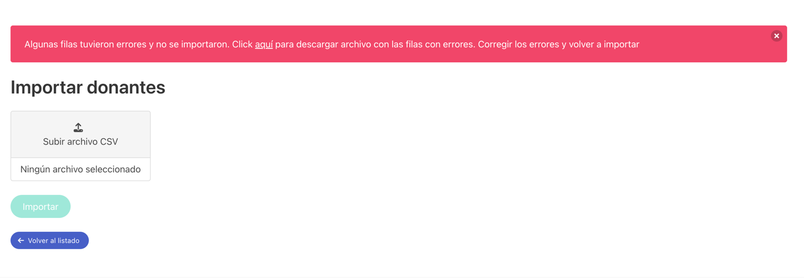

# Manual del usuario

Se cubrirán a continuación las distinas funcionalides del sistema.

- [Menú](#menú)
- [Informes](#informes)
- [Donantes](#donantes)
  - [Importar donantes](#importar-donantes)
  - [Crear donante](#crear-donante)
  - [Detalle de donante](#detalle-de-donante)
    - [Exclusiones](#exclusiones)
- [Candidatos](#candidatos)
- [Plantillas](#plantillas)
- [Automatizaciones y campañas](#automatizaciones-y-campañas)
  - [Campañas](#campañas)
  - [Automatizaciones](#automatizaciones)
- [Filtros](#filtros)
  - [Filtros por defecto](#filtros-por-defecto)
- [Clínicas](#clínicas)
- [Usuarios](#usuarios)
- [Consejos de uso](#consejos-de-uso)

## Menú

Para navegar entre las distintas secciones de la aplicación puede utilizarse el menú que aparece en la parte superior de la pantalla.

## Informes

La pestaña de informes muestra visualizaciones de datos relevantes sobre los donantes, sus donaciones y las comunicaciones que se envían.

## Donantes

En la pestaña de donantes pueden verse todos los donantes del sistema.

(los datos mostrados son de prueba, generados aleatoriamente)

La tabla puede ordenarse por nombre, tipo de donante o fecha de última donación.
También es posible buscar donantes, el sistema buscará por nombre, correo electrónico y número de documento.

### Importar donantes

Al hacer click en "Importar donantes" se permite seleccionar un archivo que contenga la información de los donantes y donaciones. IMPORTANTE: el formato del archivo debe ser csv.

Si al realizar la importación de múltiples donantes ocurren errores para algunos de ellos, el sistema permitirá descargar un archivo con el mismo formato que el que se subió, pero incluyendo únicamente las filas con errores.
Además, incluirá una nueva columna "error" que indica el motivo por el cual no fue posible realizar la importación, para que el usuario pueda realizar las correcciones necesarias. No es necesario eliminar esa columna al reimportar, ya que el sistema ingoraráesa columna.

### Crear donante

Puede también crearse un donante manualmente, haciendo click en "Crear donante" e ingresando toda la información de forma manual.

### Detalle de donante

Al hacer click en "Detalles" desde la tabla ed donantes puede verse el detalle de un donante en particular, incluyendo sus datos personales, datos de donación e información de contacto.  
A su vez, se muestra un resumen de las donaciones que realizó, así como también las comunicaciones que se le enviaron. Se muestran también las exclusiones del donante.

#### Exclusiones

Los donantes pueden tener exclusiones, que representan motivos temporales por los cuales los donantes no pueden donar (por ejemplo, una cirugía).  
Es posible crear una exclusión para un donante desde el detalle del donante. Se pedirá el motivo de la exclusión, una fecha de inicio y (opcionalmente) una fecha de fin.

Además de ingresar el motivo y las fechas manualmente, existe la posibilidad de seleccionar un tipo de exclusión común, en cuyo caso el sistema automáticamente completará el motivo y las fechas.

Pueden gestionarse esas exclusiones seleccionables desde la pestaña "Exclusiones": es posible crear nuevas y editar o eliminar existentes.

## Candidatos

La pestaña de candiadtos es igual a la de donantes. La única diferencia es que en esta pestaña solo veremos a los donantes que estén marcados como "candidatos", es decir, personas que demostraron interés en donar pero aún no lo han hecho.  
Una fuente de candidatos es el formulario de club de donantes de lw web de Hemocentro: cuando ese formulario es completado, automáticamente el sistema recibe la información y crea un candidato.

## Plantillas

Las plantillas son el contenido que se enviarán en los emails. Existen de dos tipos:

- Reutilizable: para plantillas que funcionarán como encabezado o firma. Pueden reutilizarse desde otras plantillas para evitar repetir el mismo encabezado en múltiples plantillas.
- Para campaña o automatización: son las plantillas que se usarán en las campañas/automatizaciones.
  - Con este tipo de plantillas puede seleccionarse otras plantillas reutilizables para utilizar como encabezado (se agrega al principio del contenido) o firma (se agrega al final del contenido).
  - Es necesario ingresar el asunto del email.

Para ambos tipos se utiliza el mismo editor de contenido de la plantilla. Dicho editor tiene algunas funcionalides que resulta imporatnte mencionar:
- Es posible agregar formato, links, imágenes, etc.
- Para agregar imágenes, el editor pedirá un link a la misma. Puede utilizarse cualquier link, pero el sistema proveé algunas imágenes junto con el link correspondiente.
- Es posible incluir variables en el contenido (por ejemplo: {{nombre}}). Esas variables luego son reemplazadas por la información del donante al cual se envía el email. El sistema informa las variables que están disponibles.
- Existen dos variables especiales: {{link_recibir_recordatorios}} y {{link_desuscribir}}. Si se incluyen en una plantilla, ambas son reemplazdas por un botón que dan la posibilidad al donante de actualizar si están suscriptos a los recordatorios o no. Esa información luego puede utilizarse en los filtros para incluir o excluir a determinados donantes.

## Listas

Las listas son las encargadas de seleccionar a los donantes correctos. Para ello, pueden utilizarse una combinación de filtros.

Existen cuatro tipos de filtros disponibles:

- Información del donante: permite comparar un dato del donante (por ejemplo, qué tipo de donante es), un operador (igual, distinto, etc.) y un valor (reposición, voluntario, del club).
- Información de la última donación: permite comparar un dato de la última donación del donante (por ejemplo, la fecha), un operador (igual, distinto, mayor, menor, etc.) y un valor (hoy, 1 mes, 2 meses, etc.).
- Donación posterior a contacto: permite seleccionar una automatización o campaña. Selecciona a los donantes cuya última donación sea posterior a haber recibido dicha automatización/campaña.
- Cumpleaños del donante es hoy: no toma ningún parámetro, selecciona a los donantes cuyo cumpleaños sea en el día actual.

Se pueden combinar tantos filtros como sean necesarios. Todos los filtros deben cumplirse para que un donante sea seleccionado.

Una vez creada, las listas nos permiten ver que donantes cumplen con los filtros elegidos.

### Filtros por defecto

Hay filtros que se aplican siempre, incluso cuando no están agregados explícitamente en una lista. Esos filtros son:

- Edad de donante apta (entre 18 y 65 años)
- Donante sin serología reactiva
- Donante sin exclusiones vigentes
- Última donación de donante no rechazada
- Además, las automatizaciones se envían una única vez por cada donación (esto evita enviar el mismo email múltiples veces al mismo donante).

## Automatizaciones y campañas

Tanto las automatizaciones como las campañas representan los distintos contactos que se quieren enviar a los donantes.  
Ambas consisten de una plantilla (el contenido que se va a enviar), una lista (a quienes se les va a enviar) y un remitente (el email desde el cual se va a enviar).

Tienen algunas diferencias entre sí.

### Campañas

Las campañas se envían **manualmente**. Están pensadas para eventos de única vez o periódicos poco frecuentes, tales como colectas externas, saludos por día del donante, etc.

Una vez creada, podemos ver el siguiente detalle:

La campaña nos permite enviarla inmediatamente o programar el envío, para lo cual es posible seleccionar una fecha y hora. Pueden programarse más de un envío a la vez.  
Además, nos muestra los envíos que ya sucedieron en el pasado.

También nos muestra a qué donantes se enviará la campaña, además del contenido que recibirán en el email.

Por último, hay un gráfico de efectividad de la campaña, que indica qué porcentaje de donantes volvieron a donar luego de recibirla.

### Automatizaciones

Las automatizaciones, a diferencia de las campañas, se envían automáticamente.  
Todos los días el sistema toma todas las automatizaciones activas (es posible activarlas y desactivarlas), selecciona a los donantes que cumplen con los filtros y envía los emails correspondientes.

Al igual que las campañas, las automatizaciones nos permiten ver que donantes serán contactados.  
Un detalle importante es que los donantes allí mostrados pueden no coincidir al 100% con los donantes motrados por la lista seleccionada para la automatización.
Esto es porque en el caso de las automatizaciones (no así en la campañas), se evita enviar una misma automatización por donación.

## Clínicas

Pueden verse las clínicas existentes y editarlas, además de poder crear nuevas.  
Esto permite vincular las donaciones con las distintas clínicas. Para ello, el código de las clínicas debe coincidir con el código informado en el archivo de importación. El nombre de las clínicas puede cambiarse sin restricciones.

## Usuarios

Desde aquí pueden crearse o eliminarse usuarios que tendrán acceso al sistema.  
Al invitar a un usuario, se le enviará un email para que pueda crear su cuenta.

## Consejos de uso

Un concepto muy importante al trabajar con el envío de emails es la reputación del remitente.  
Al enviar un email, la dirección de correo electrónico desde la cual se envía tiene una reputación, esa reputación está calculada en base a la cantidad de emails enviados, la cantidad entregados correctamente, la cantidad de rebotados (por ejemplo porque el email de destino era inexistente), la cantidad de emails enviados marcados como spam, entre otros.

Es muy imporatnte mantener una buena reputación, ya que de lo contrario los emails enviados pueden empezar a llegar a ser filtrados y ser enviados automáticamente a spam.

Por eso, se dejan algunos consejos para cuidar de la reputación de las direcciones remitentes:

- Incluir siempre que se pueda un filtro de "donante suscripto = sí", para asegurar que el donante quiera recibir el email.
  - Esto aplica principalmente para donantes por reposición.
- Relacionado al punto anterior, incluir siempre en las plantillas la variable {{link_desuscribir}}, para que los donantes puedan elegir no recibir más emails.
